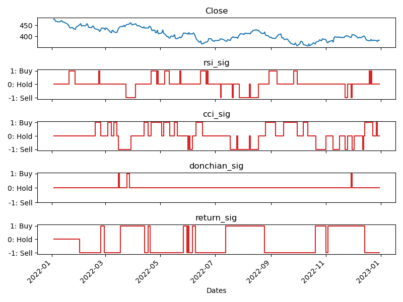

# DQN RL Trader Agent

This repository contains codes and documents of my AI project about an application of reinforcement learning for trading. The AI trader uses a very simplified represenation of the stock market (state variables) and is trained to achieve a trading strategy that maximizes profit based on the devised reward formula.

The project allows to obtain a trading strategy based on historial price data of a stock symbol, which tends to maximize profitability over the given timeframe. It's noteworhtly that long-term profitablity and short-term profitablity may lead to different strategy and they are highly dependent on the latent variables. As a result, a trader trained over a specific time period may perform very badly for another time period (overfitting problem). To prevent this, it's important to obtain a generalized strategy by training the agent over various time periods that cover various price regimes (stock situations).

The codes provide functionalities for training and testing trading agents in a simulated environment. It includes:

- Reading input files containing historical stock data.
- Training a trading agent using reinforcement learning (DQN RL).
- Testing the trained agent and benchmarking against several baseline trading strategies.
- Plotting the trading logs and performance metrics.

## Dependencies

- `os`
- `random`
- `stock_analysis`
- `IPython.display`
- `matplotlib`
- `pandas`
- `trader_classes`

## Usage

1. Ensure all dependencies are installed.
2. Run the script using Python 3. You can either run the dqn_trader.py or dqn_trader.ipynb. 
3. Adjust parameters such as the number of episodes (`n_ep`), batch size (`batch_size`), and reset probability (`reset_pr`) as needed.
4. Monitor the training process through printed episode statistics and plotted rewards mean and standard deviation.
5. After training, test the agent's performance and visualize the trading logs and benchmark comparisons.

## Functions

### `read_input_files(file_names)`

- Reads input CSV files containing historical stock data.
- Merges the dataframes based on the date column.
- Returns a single merged dataframe.

### `plot_time_log(logs, file_name)`

- Plots various trading metrics over time, including close price, number of shares, balance, portfolio value, and actions taken.
- Saves the plot as a PDF file.

### `plot_benchmark_log(logs_list, file_name)`

- Plots benchmark comparison logs alongside the trained agent's logs.
- Compares close price, number of shares, total portfolio value, and actions taken.
- Saves the plot as a PDF file.

### `train_agent(env, agent, n_ep, batch_size, reset_pr)`

- Trains a trading agent in a given environment using reinforcement learning.
- Conducts training over a specified number of episodes (`n_ep`), with a specified batch size for replay memory (`batch_size`) and reset probability (`reset_pr`).
- Returns the trained agent.

### `test_agent(agent, env)`

- Tests a trained agent in a simulated trading environment.
- Compares the agent's performance against several baseline trading strategies (RSI, CCI, Donchian, Return).
- Visualizes the trading logs and benchmark comparisons.

  ## Results
  A sample of the features, comprised of indicator signals, used to train the model is illustrated below.
  

  The performance of the trained trading agent vs the performance of the individual technical indicator signals is provided below.
  

## Notes

- Adjust hyperparameters and environment settings based on specific requirements and characteristics of the trading scenario.
- Ensure proper understanding of reinforcement learning concepts and potential risks associated with live trading applications.
